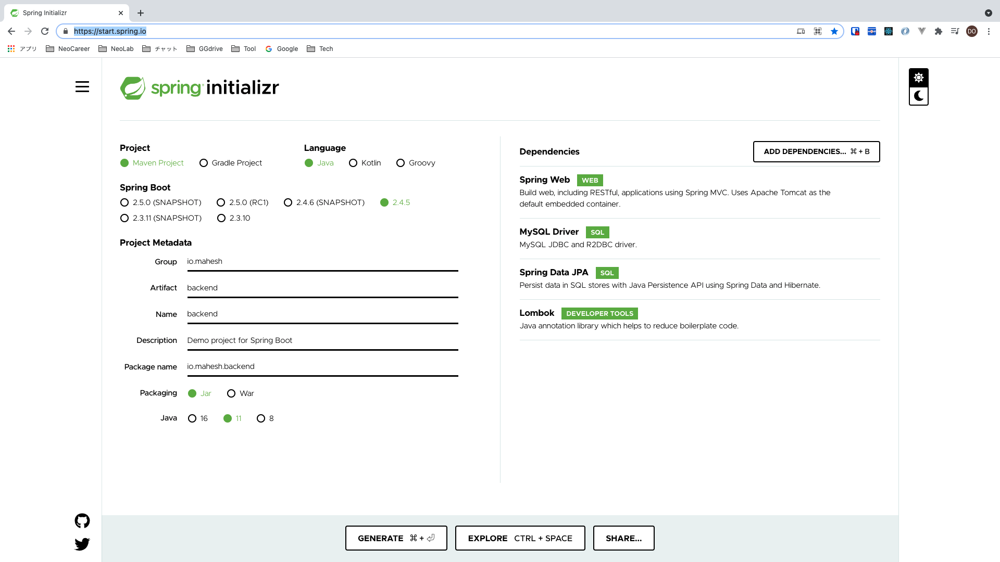
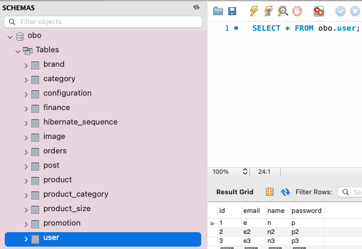
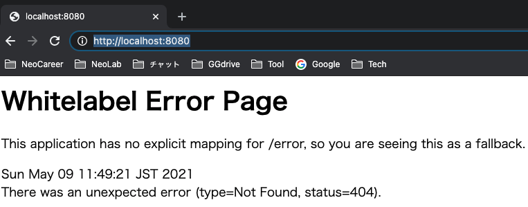
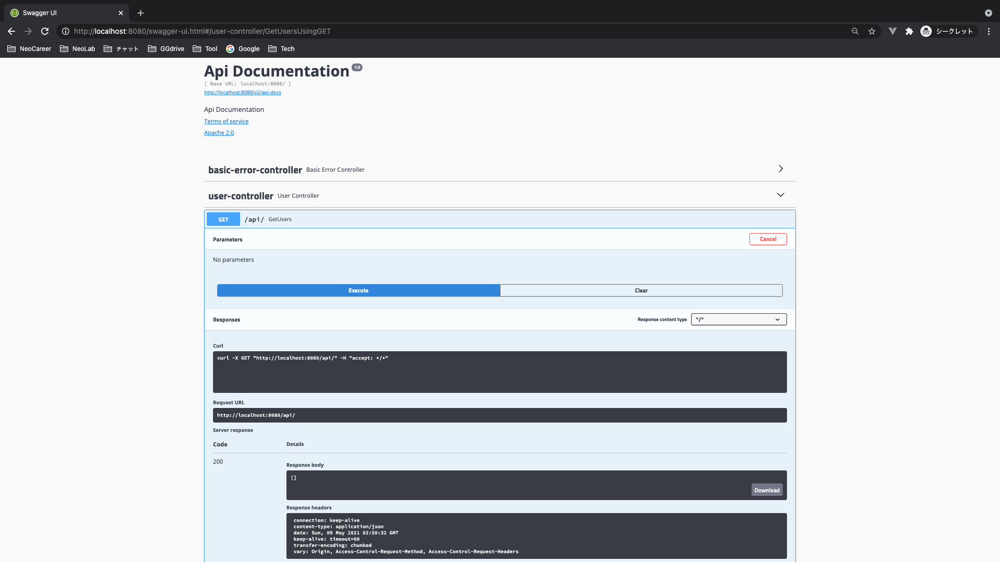
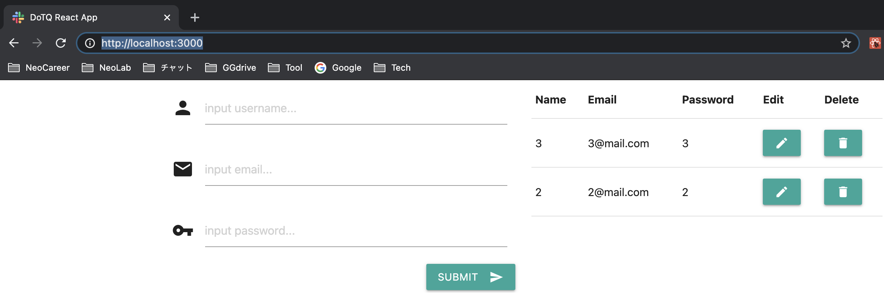

# reactjs-springboot-swagger-crud-list 🐳


## create new Spring boot project
### create project
#### in VSCode
1. ＞spring initializer: maven
2. spring boot ver: `2.3.10` (OR `2.4.5`)
3. language: java
4. group id: `io.mahesh`
5. artifact id: `backend`
6. packaging type: jar
7. java ver: `8` (OR `11`)
8. : `MySQL Driver` & `Spring Web` & `Spring Data JPA` & `Lombok`
#### in online tool

### add Maven dependencies
`JAVA PROJECTS > Maven Dependencies[+] > springfox-swagger-ui(2.9.2) & springfox-swagger2(2.9.2) & spring-boot-starter-validation`
=> auto add into `pom.xml`

## install frontend
- `npm i axios`

## db: this project NOT build a db server, 'localhost:33060/obo' just for example!!!
- backend/src/main/java/io/mahesh/backend/UserRepository.java:
- `public interface UserRepository extends JpaRepository<User,Long> {...}` means: tablename=`user` & `id` is `Long`
=> auto create table `obo.user`
- backend/src/main/java/io/mahesh/backend/User.java:
```java
@Id
@GeneratedValue(strategy = GenerationType.AUTO)
```
- => `id` is auto increment


## api
- in `backend/src/main/java/io/mahesh/backend/UserController.java > @GetMapping("/...")`

## run
### backend
- VSCode > `SPRING BOOT DASHBOARD` > `backend` > click `start` icon
>(note) need `backend/src/main/resources/application.properties: spring.datasource.* & spring.jpa.hibernate.ddl-auto` due to dependencies `MySQL Driver`
>=> can NOT run spring boot if has wrong DB's inform or leave blank!!!
- access browser `localhost:8080`

- access browser `localhost:8080/swagger-ui.html`
>(note:) need `backend/src/main/java/io/mahesh/backend/DemoApplication.java: @EnableSwagger2`
- click `user-controller` > `/api/GetUsers` > `Try it out` > `Execute`

### frontend
1. `cd frontend`
2. `frontend$ npm i`
3. `frontend$ npm run start`
4. access browser `localhost:3000`

